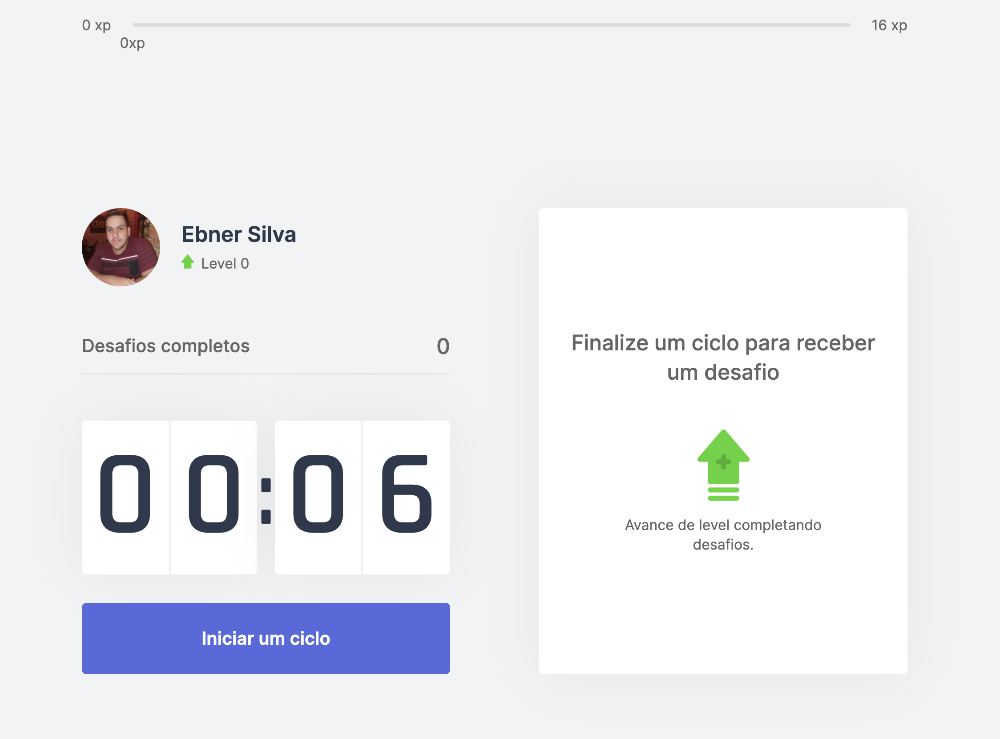
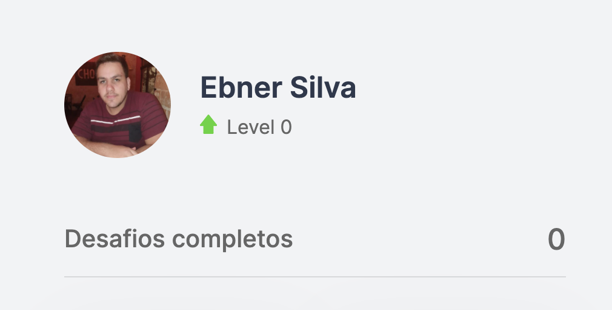
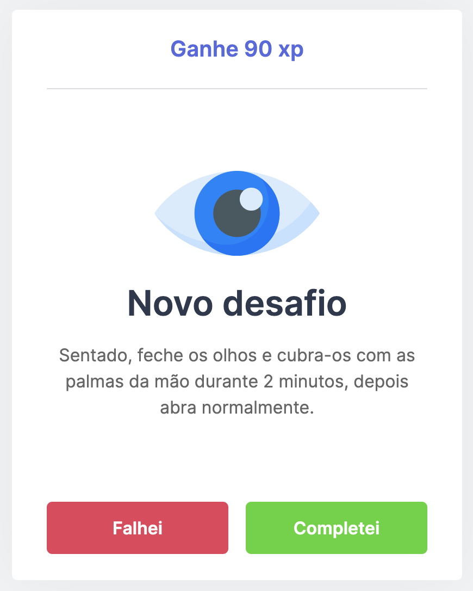
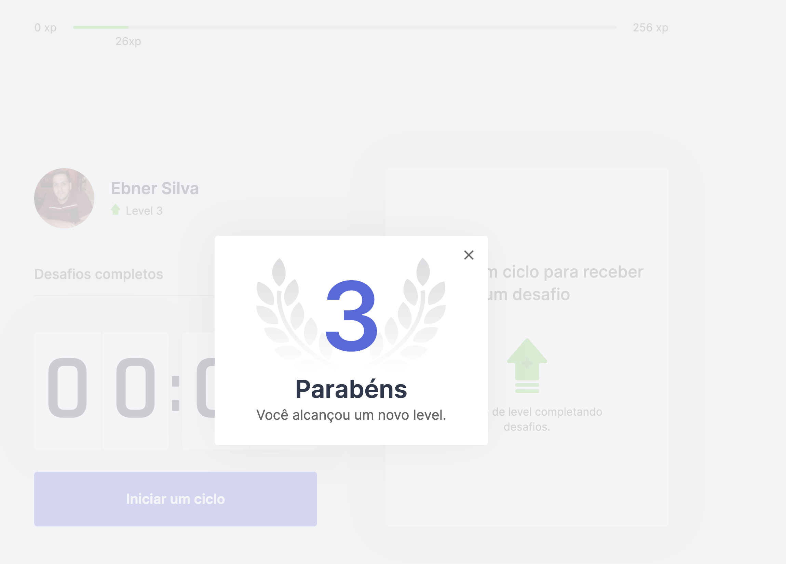
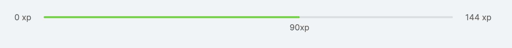

<h3 align="center">
  Move.it
</h3>

<blockquote align="center">Vença desafios, ganhe pontos, suba de nível e não perca tempo!</blockquote>

  

  

  

  <a href="#rocket-sobre-a-aplicação">Sobre a aplicação</a>&nbsp;&nbsp;&nbsp;|&nbsp;&nbsp;&nbsp;
  <a href="#memo-licença">Licença</a>

## :memo: Como utilizar?

- **`git clone https://github.com/ebnersilva/moveit-nextjs`**
- **`yarn or npm install`**
- **`yarn dev`**
- **`😄 enjoy 😄`**

## :rocket: Sobre a aplicação

Sabemos que pessoas que trabalham o dia todo na frente do computador acabam não tirando aquele tempo essencial no dia a dia para cuidar do corpo e mente.

De acordo com o problema surgiu o Move.it uma aplicação desenvolvida na next level week 4 da Rocketseat. Com essa aplicação você pode trabalhar com um cronômetro que ao terminar o tempo de cada "sprint" você recebe um desafio (Desafio esse para cuidar de sua saúde). Finalizando o desafio você ganha pontos, aumenta o seu xp e pode subir de nível dependendo do level em que você está.

E aí, bora cuidar da saúde?

## :memo: Tecnologias

- :memo: **`NextJS`**
- :cookie: **`Cookies`**
- :memo: **`Context API`**

### No momento utilizamos uma fake API

No back-end utilizamos uma fake-api em um JSON com vários desafios cadastrados mas nada impede que você clone esse repositório, crie uma api e trabalhe da forma que quiser.

- **`API: challenges.json`**

### Funcionalidades da aplicação

- **`Cronômetro`**: Cronômetro para gerir o tempo para cuidar da sua saúde.

- **`Desafios para cuidar da saúde e mente`**: Vários desafios para você cuidar da sua saúde/mente.

- **`XP`**: Você tem o seu nível de XP que é incrementado a cada desafio.

- **`Level`**: Ao fazer desafios o seu level pode aumentar de acordo com a pontuação de cada desafio.

- **`Desafios finalizados`**: A Aplicação também armazena quantos desafios você já finalizou.

- **`Armazenamento em Cookies`**: Essa aplicação também armazena os dados de Xp, level, desafios finalizados nos cookies do navegador, dessa forma se você sair do app e entrar novamente seus dados estarão lá, intactos.

### Demonstração

- **`Dashboard`**

  

- **`Profile`**

  

- **`Challenge`**

  

- **`Congratulations`**

  

- **`Xp`**

  

## :memo: Licença

Esse projeto está sob a licença MIT. Veja o arquivo [LICENSE](LICENSE) para mais detalhes.

---

Feito com 💜 by Ebner Silva :wave:
